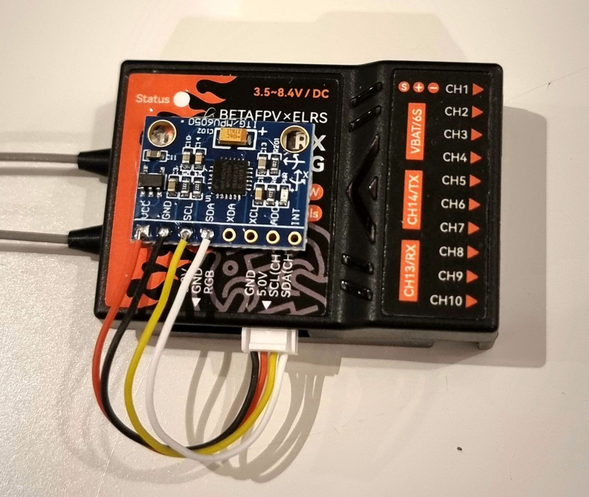

## ExpressLRS RX with Gyro Support

This branch adds support for an external i2c gyroscope for various stabilization
modes.

This is an experimental branch not ready for prime time.

Experiment at your own risk.

## Todo List

- [x] Global servo output limits
- [x] LUA PID adjustment settings
- [x] Automatic subtrim detection
- [ ] Scale channel outputs according to channel limits
- [x] Scale corrections according to channel limits
- [x] Add generic mixer (gyro -> channel)
  - [ ] Preset for V-Tail mixing
  - [ ] Preset for Elevon mixing
  - [ ] Conditional mixing, i.e. nose wheel correction when gear down
- [ ] Add gyro orientation configuration (partly done)
- [ ] Standardize and document gains across modes
- [x] Gyro mode: Rate
- [ ] Gyro mode: Lock / Hold
- [x] Gyro mode: Safe
- [x] Gyro mode: Level
- [x] Gyro mode: Launch (Level + pitch up)
- [x] Gyro mode: Hover
- [ ] Gyro mode: Knife Edge (Quart lock)

## Setup

Some gyro settings are available through the
[ExpressLRS Lua script](https://www.expresslrs.org/quick-start/transmitters/lua-howto/).

The mixer settings and channel assignments are available through the web UI.

### Mixer Setup

* In the web UI a input channel must be mixed to the "Gyro Mode" output.
* In the web UI a input channel must be mixed to the "Gyro Gain" output.
* In the web UI mixing of "Gyro Roll Cmd" inputs must be mixed to relevant outputs.
* In the ExpressLRS Lua script the "gyro_mode" and "gyro_gain" must be set.

#### Rate Mode

This is the most basic gyro mode. Changes to the angular velocity in any
direction will result in a correction.

### Heading Hold / Heading Lock Mode

Not yet implemented.

#### SAFE Mode

In this mode the gyro will work to limit pitch and roll angles within the configured limits.

#### Level Mode

In this mode the gyro will work to keep the pitch and roll angles at zero when
channel inputs are zero.

If the roll stick command is 50%, the gyro will attempt to keep the roll angle
at 50% of the max roll angle.

#### Hover Mode

In this mode the gyro will add corrections to elevator and rudder channels in
order to keep aircraft pointing directly upwards.

## DIY Hardware

The test hardware currently used is a BetaFPV SuperP receiver with a GY-521 MPU-6050 I2C module.

